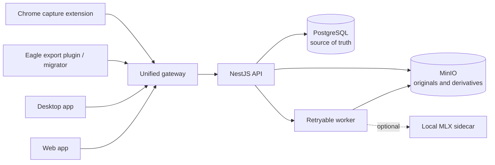

<p align="center">
  
</p>

<h1 align="center">SekerEagle</h1>

<p align="center">
  <a href="README.md">简体中文</a> · <strong>English</strong>
</p>

<p align="center">
  <strong>A place for every spark of inspiration.</strong><br />
  A self-hosted image and video library that finds images from fuzzy descriptions and learns from your manual tags.
</p>

<p align="center">
  <a href="https://github.com/Seker800/SekerEagle/actions/workflows/ci.yml"></a>
  <a href="LICENSE"></a>
  
  
  
</p>

<p align="center">
  <a href="#product-components">Components</a> ·
  <a href="#two-signature-experiences">Core experiences</a> ·
  <a href="#features">Features</a> ·
  <a href="#quick-start">Quick start</a> ·
  <a href="#migrating-from-eagle">Eagle migration</a> ·
  <a href="#browser-capture">Browser capture</a> ·
  <a href="#architecture-and-data-boundaries">Architecture</a> ·
  <a href="#documentation">Documentation</a>
</p>

## Two signature experiences

### 🔎 Fuzzy search: find an image without remembering its exact name or tag

Search with an approximate concept. If AI tagged assets as “sedan” or “sports car,” a search for
“car” can still find them. SekerEagle combines filenames, manual tags, automatically generated AI
tags, and semantic similarity between tag embeddings. Exact matches rank first, followed by
semantically related results. Ollama generates tags locally, while the MLX service computes text
and tag embeddings; your assets do not need to leave your machine.

### 🗂️ Automatic image classification: make manual tags smarter over time

Manually label a small set of representative images. SekerEagle groups their visual embeddings
into one or more prototype centers for each tag, then proposes a category for new images according
to their distance from those centers. Review, adjust, reject, or batch-confirm suggestions by
similarity, and handle uncertain images directly. Manual tags remain the source of truth while the
model removes repetitive sorting work. The complete workflow—from embeddings and prototype builds
to distance inspection and batch review—is available today.

> Both are optional local-AI features and remain disabled by default, so regular uploads and
> browsing do not depend on them. See the
> [vector and manual-tag workflow](docs/operations-runbook.md#图片向量与人工标签建议) (Chinese).

## Product components

SekerEagle is not a single web application. It is a coordinated set of clients, capture tools, and self-hosted services built around one asset library:

| Component           | Responsibility                                                                                                                           | Form                                                |
| ------------------- | ---------------------------------------------------------------------------------------------------------------------------------------- | --------------------------------------------------- |
| **Capture plugins** | Capture original images, provenance, and descriptions from the web; export verifiable migration snapshots from Eagle                     | Chrome Manifest V3 extension + Eagle export plugin  |
| **Desktop app**     | Connect to a local, LAN, or public server, manage assets in the shared interface, and accelerate browsing with a rebuildable local cache | Electron desktop client, currently macOS-first      |
| **Server**          | Own authentication, user isolation, uploads, deduplication, media processing, search, and persistence                                    | Gateway + NestJS API + worker + PostgreSQL + MinIO  |
| **Web app**         | Provide masonry browsing, filters, tags, smart folders, previews, and administration                                                     | React / Vite application used directly in a browser |

Every component works through the same gateway. The desktop and web apps share the same server-side library, while capture plugins reliably deliver new assets into it. A local Eagle migrator and an optional MLX vector service add bulk migration and intelligent tag suggestions.


The system brings scattered images, posters, interface references, and short videos into one
library. Browse them from the desktop or web app, organize them with tags, colors, ratings,
formats, and smart folders, and keep collecting through capture plugins or Eagle migration tools.
Your original files and metadata remain in your own PostgreSQL and MinIO deployment, with no
telemetry enabled by default.

> [!IMPORTANT]
> SekerEagle is currently in its early public `0.1.x` stage. Core asset management and ingestion
> paths are available, but APIs, data models, and deployment conventions may still change between
> minor releases. Back up PostgreSQL and MinIO before upgrading.

> [!NOTE]
> SekerEagle is an independent community project. It is not an official Eagle product and is not
> sponsored or endorsed by the Eagle team. “Eagle” is used only to describe compatibility and
> migration sources.

## Interface preview

<table>
  <tr>
    <td width="50%">
      
      <br /><sub><b>Asset details</b> — Edit titles, tags, ratings, sources, colors, and media metadata.</sub>
    </td>
    <td width="50%">
      
      <br /><sub><b>Immersive preview</b> — Zoom with the mouse wheel, pan by dragging, and stream tiled regions of very large images.</sub>
    </td>
  </tr>
  <tr>
    <td width="50%">
      
      <br /><sub><b>Tag workspace</b> — Search, group, color, star, and inspect asset counts.</sub>
    </td>
    <td width="50%">
      
      <br /><sub><b>Media processing</b> — Manage browsing derivatives, color analysis, tag suggestions, and background jobs.</sub>
    </td>
  </tr>
</table>

> Screenshots use maintainer-generated demo assets and contain no real user content.

## Features

### Collection and ingestion

- Drag in images or MP4 files with multipart upload, SHA-256 deduplication, and recoverable object
  commits.
- Capture source images, page provenance, and descriptions with `Alt + right-click` in the Chrome
  extension.
- Migrate Eagle libraries with snapshot preflight checks, small-sample runs, pause/resume,
  idempotent replay, and final verification.
- Keep every client behind the same-origin gateway; no browser or import tool connects directly to
  PostgreSQL or object storage.

### Browsing and organization

- Browse with a responsive masonry layout, adjustable thumbnail sizes, and a bounded DOM designed
  for large libraries.
- Use fuzzy search across filenames, manual tags, AI-generated tags, and semantically related tags,
  with exact results ranked first.
- Combine filters for color, tag, shape, rating, format, and AI tags.
- Organize manual tags with colors, groups, favorites, Pinyin indexing, search, and batch assignment.
- Build smart folders with combined rules, live result counts, and a folder tree; matching assets
  appear automatically.
- Edit titles, descriptions, sources, tags, and ratings from the details panel; restore assets from
  the trash or purge them permanently.

### Media and large images

- Generate 256/512 px thumbnails, 1600 px previews, video posters, and media metadata in the worker.
- Build Deep Zoom WebP pyramids for very large images; the viewer loads only the visible region and
  keeps a bounded tile cache.
- Extract representative colors in the background and index them for Lab color-distance searches.
- Retry, schedule, and pause processing jobs while keeping interactive previews ahead of historical
  backfills.

### Optional local AI features

- Run a pinned Qwen3-VL-Embedding-2B MLX sidecar on Apple Silicon.
- Generate local 1024-dimensional image embeddings, aggregate manually classified examples into
  tag prototype centers, and propose reviewable classifications by distance.
- Keep every tag opted out by default; suggestions start only after the user explicitly enables a
  tag and builds its prototype center.
- Use Qwen3-VL 8B Instruct through a local Ollama runtime to generate concrete noun tags and expand
  searches by exact match and semantic similarity.
- Keep vector suggestions and automatic tagging stopped by default. Normal uploads and library
  browsing do not depend on either local model.

### Multi-user privacy and security

- Use HttpOnly cookies for browser sessions and least-privilege personal access tokens for plugins
  and migration tools.
- Derive every `ownerId` from the authenticated principal; request DTOs never accept an `ownerId`.
- Return `404` for cross-owner access without revealing whether a resource exists.
- Reveal private assets only during a time-limited visibility window. The default deployment stays
  local and includes no telemetry.

## Where does it fit?

| Use case                          | What SekerEagle provides                                                                |
| --------------------------------- | --------------------------------------------------------------------------------------- |
| Design references and inspiration | Masonry browsing, manual tags, color and compound filters, smart folders                |
| Independent migration from Eagle  | Immutable snapshots, full preflight, resumable uploads, per-item journals, verification |
| Ongoing collection from the web   | Manifest V3 extension, durable local queue, provenance retention, retries               |
| Multiple users on one deployment  | Separate accounts, owner-level isolation, administrator processing center               |
| Private local image organization  | Self-hosted database and object storage, optional local model, no telemetry             |

SekerEagle is not currently a mobile photo backup tool, and it does not provide public sharing links
or team approval workflows. If automatic phone backup is your primary goal, consider a dedicated
photo management project instead.

## Support matrix

| Capability                 |        Status        | Notes                                                                     |
| -------------------------- | :------------------: | ------------------------------------------------------------------------- |
| macOS + Apple Silicon      |  ✅ Supported path   | Current development, deployment, and performance test environment         |
| Docker Desktop deployment  |          ✅          | PostgreSQL, MinIO, API, web, worker, and gateway                          |
| macOS desktop app          | ✅ Development-ready | Connects to local, LAN, or public servers with a rebuildable media cache  |
| Windows x64 desktop app    | Internal-test ready  | Single-file portable app with profile and cache stored beside the program |
| Web asset library          |          ✅          | Desktop browsers first                                                    |
| Chrome browser capture     |          ✅          | Unpacked Manifest V3 extension                                            |
| Eagle snapshot migration   |          ✅          | Local CLI plus Eagle export plugin                                        |
| Local MLX classification   |  ✅ Optional, ready  | Available; requires Apple Silicon, `uv`, and a model download             |
| AI tags and fuzzy search   |  ✅ Optional, ready  | Available; requires local Ollama and `qwen3-vl:8b-instruct`               |
| Linux / x64                |     Experimental     | Non-vector TypeScript components may work; no complete supported path yet |
| Native mobile app          |          ❌          | Not currently available                                                   |

Allocate at least 16 GiB of memory and 8 CPUs to Docker Desktop. The PostgreSQL metadata path has
been independently benchmarked with 100,000 assets. That result does not mean object-storage
capacity, backups, or disk redundancy are handled automatically. See the
[100k-library performance baseline](docs/performance-100k-library.md) (Chinese).

## Quick start

### Prerequisites

- macOS on Apple Silicon
- Node.js 22 and npm 10
- Docker Desktop
- Optional: `uv` for the local vector sidecar
- Optional: Ollama with `qwen3-vl:8b-instruct` for automatic noun tagging

### Start the services

```sh
git clone https://github.com/Seker800/SekerEagle.git
cd SekerEagle
npm ci
npm run db:generate
npm run env:create
./scripts/mlx-embedding-host.sh setup
npm run mlx:install-service
npm run compose:config
docker compose --env-file .env -f deploy/mac/docker-compose.yml up -d --build
```

If you do not need vector tag suggestions, skip the MLX setup and service installation steps.
Automatic noun tagging additionally requires Ollama and `qwen3-vl:8b-instruct`; both AI features
remain stopped by default. Then create the first administrator:

```sh
docker compose --env-file .env -f deploy/mac/docker-compose.yml exec \
  -e BOOTSTRAP_ADMIN_EMAIL=you@example.com \
  -e BOOTSTRAP_ADMIN_PASSWORD='replace-with-a-long-password' \
  api node apps/api/dist/bootstrap-admin.js
```

Open <http://localhost:8180>. Only the gateway should bind to the host at `127.0.0.1:8180`; do not
expose PostgreSQL, MinIO, the API, or the worker directly. See the
[local operations runbook](docs/operations-runbook.md) (Chinese) for setup, diagnostics, upgrades,
and shutdown procedures.

To access SekerEagle from another trusted LAN computer at `http://IP:8180`, set
`SEKEREAGLE_GATEWAY_LAN_ADDRESS` in `.env` to the server's fixed private IP and apply the LAN
Compose overlay. The default `127.0.0.1` entry remains available; do not use `0.0.0.0`, and
restrict source devices with the host firewall.
The overlay also adds that exact address to the trusted browser origins so LAN login and writes work.

## Migrating from Eagle

Migration does not read and mutate the live source library at the same time. Copy the Eagle
`.library` first, export an immutable snapshot with `plugins/eagle-importer`, and let the local
migrator run preflight checks and uploads:

```sh
npm run build --workspace @sekereagle/eagle-migrator
read -s SEKEREAGLE_PAT
export SEKEREAGLE_PAT

node apps/eagle-migrator/dist/main.js doctor /absolute/path/to/migration-snapshot \
  --server http://localhost:8180
node apps/eagle-migrator/dist/main.js run /absolute/path/to/migration-snapshot \
  --server http://localhost:8180 --concurrency 4
```

Start with a sample of 20–100 items covering different formats, duplicates, non-ASCII names, tags,
and folders, and rehearse pause/resume at least once. See the
[local Eagle migrator guide](apps/eagle-migrator/README.md) (Chinese) for the complete workflow.

## Browser capture

The Chrome extension writes captures to IndexedDB before its Service Worker downloads candidate
source images, uploads them in parts, and commits them. Interrupted browser or extension sessions
return unfinished work to the retry queue.

```text
Web page Alt + right-click
            ↓
Image candidate resolution and provenance cleanup
            ↓
Durable IndexedDB queue
            ↓
Gateway + least-privilege PAT
            ↓
MinIO originals + PostgreSQL metadata + worker derivatives
```

See the [browser capture extension guide](plugins/browser-capture/README.md) (Chinese) for
installation, PAT scopes, local/public connection modes, and supported formats.

## Architecture and data boundaries



- The desktop app loads the same management interface as the web app and accelerates media reads
  with a rebuildable cache isolated by deployment and account.
- NestJS owns authentication, owner isolation, upload state machines, and business rules.
- PostgreSQL is the source of truth. MinIO stores originals and derivatives, and recoverable state
  machines converge changes across both systems.
- A worker crash does not change an already committed asset fact; failed jobs can be retried safely.
- Browsers and import tools access only the gateway. The runtime does not depend on or access the
  SekerChat data plane.

See the [architecture documentation](docs/architecture.md) (Chinese) for dependency direction,
media memory boundaries, and system invariants.

## Documentation

The detailed operational and maintainer documentation is currently written in Simplified Chinese.
English translations can be added incrementally without blocking the English project overview.

| Document                                                              | When to read it                                                       |
| --------------------------------------------------------------------- | --------------------------------------------------------------------- |
| [Maintainer guide](docs/maintainer-guide.md)                          | First-time codebase handoff, directory ownership, and releases        |
| [Local operations runbook](docs/operations-runbook.md)                | Installation, startup, diagnostics, backup, and vector operations     |
| [Architecture](docs/architecture.md)                                  | Service boundaries, data flow, and long-lived invariants              |
| [Environment model](docs/environment-model.md)                        | Development/test/production targets and fail-closed rules             |
| [Media memory operations](docs/media-memory-operations.md)            | Large images, worker tuning, and capacity planning                    |
| [100k-library performance baseline](docs/performance-100k-library.md) | Re-running scale gates and evaluating metadata performance            |
| [Privacy](PRIVACY.md)                                                 | Data responsibilities for operators, plugin users, and administrators |
| [Security policy](SECURITY.md)                                        | Reporting vulnerabilities and checking supported versions             |
| [Contributing](CONTRIBUTING.md)                                       | Development, testing, and submitting changes                          |

## Development and verification

```sh
npm ci
npm run db:generate
npm run ci:check
./scripts/mlx-embedding-host.sh test
npm run oss:check
```

Database migrations, seeds, tests, and imports must pass the safe-target guard first. Development
databases may only be named `sekereagle` or `sekereagle_test`, and object-storage buckets must use
the `sekereagle-` prefix.

Core stack: Node.js 22, npm workspaces, NestJS, React/Vite, Prisma, PostgreSQL, pgvector, MinIO,
Sharp, OpenSeadragon, and an optional Python/MLX sidecar.

## Project status and roadmap

The current priority is making `0.1.x` deployment, migration, recovery, and public release workflows
reliable. Future priorities will follow Issues and real-world feedback, with an approximate focus on:

- smoother installation and upgrades for new instances;
- verifiable PostgreSQL and MinIO backup/restore procedures;
- Linux/x64 validation for non-vector deployments;
- continued compatibility across imports, browser capture, and large-library scenarios.

See the [changelog](CHANGELOG.md) for public release changes. Use GitHub Issues for ordinary
problems. Do not file security vulnerabilities publicly; report them privately according to the
[security policy](SECURITY.md).

## Contributing

Issues, documentation improvements, and focused pull requests are welcome. Read the
[contributing guide](CONTRIBUTING.md), [code of conduct](CODE_OF_CONDUCT.md), and
[support policy](SUPPORT.md) before getting started. These documents are currently in Simplified
Chinese.

## License

Except for `services/mlx-embedding`, repository code is released under the
[Apache License 2.0](LICENSE). Because `services/mlx-embedding` directly uses GPLv3-licensed
`mlx-embeddings`, that service is released separately under
[GPL-3.0-only](services/mlx-embedding/LICENSE). See
[third-party notices](THIRD_PARTY_NOTICES.md) for component and model attribution.
