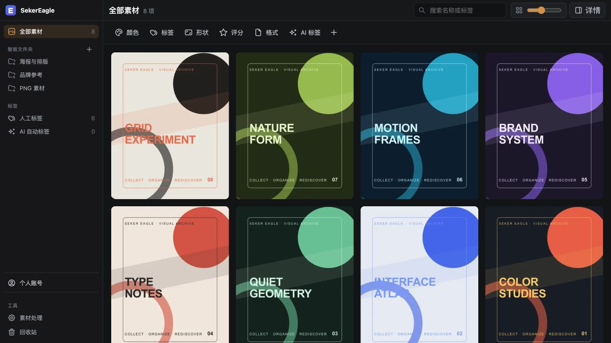
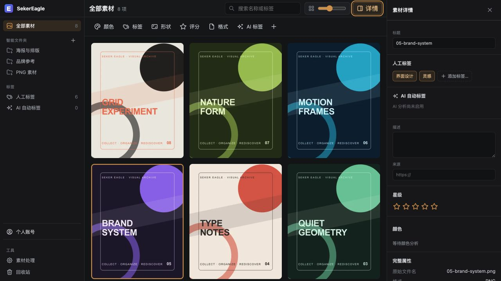
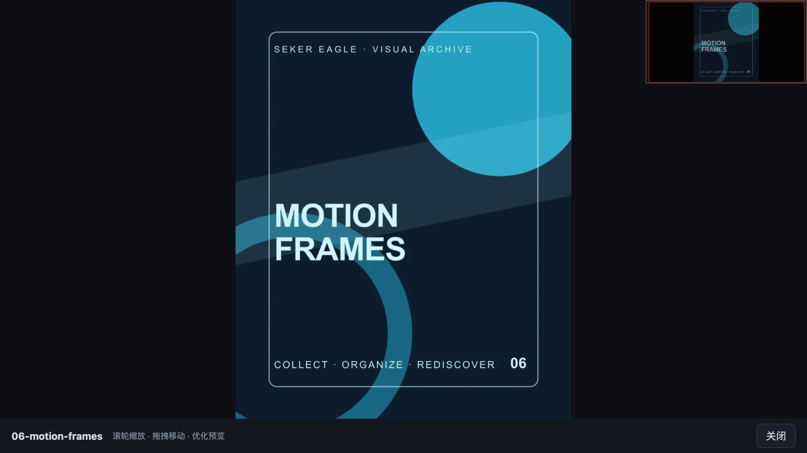
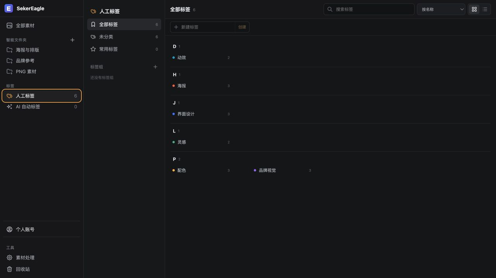
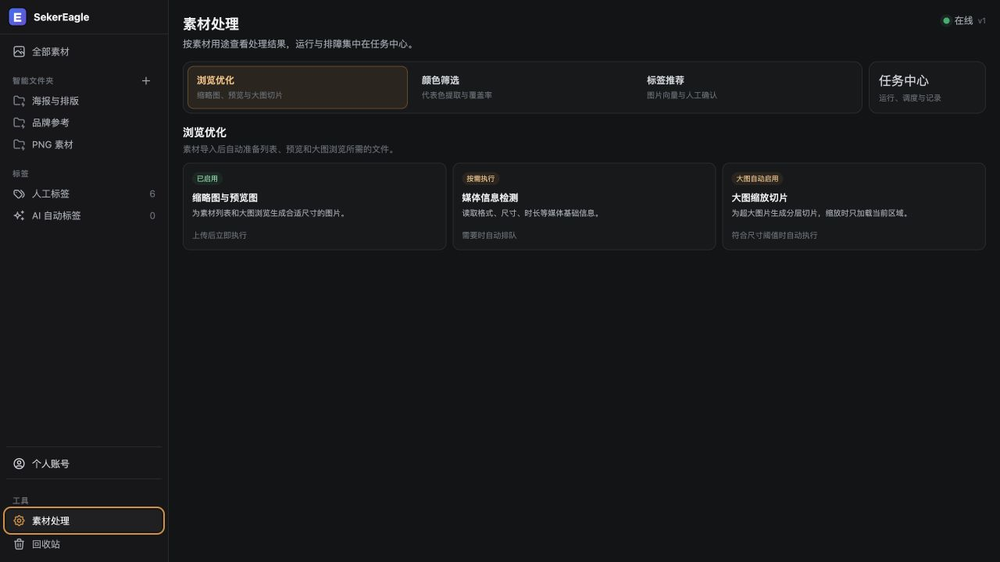
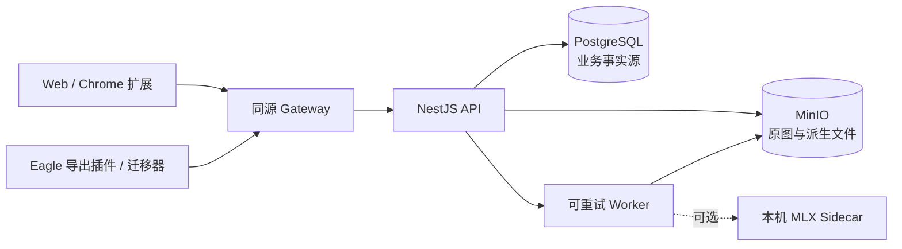

<p align="center">
  
</p>

<h1 align="center">SekerEagle</h1>

<p align="center">
  <strong>简体中文</strong> · <a href="README.en.md">English</a>
</p>

<p align="center">
  <strong>让灵感，各归其位。</strong><br />
  独立、自托管、多用户隔离的个人视觉素材库。
</p>

<p align="center">
  <a href="https://github.com/Seker800/SekerEagle/actions/workflows/ci.yml"></a>
  <a href="LICENSE"></a>
  
  
  
</p>

<p align="center">
  <a href="#功能一览">功能</a> ·
  <a href="#快速开始">快速开始</a> ·
  <a href="#从-eagle-迁移">Eagle 迁移</a> ·
  <a href="#浏览器采集">浏览器采集</a> ·
  <a href="#架构与数据边界">架构</a> ·
  <a href="#文档导航">文档</a>
</p>



SekerEagle 把散落的图片、海报、界面参考和短视频收进自己的素材库：用瀑布流浏览，
用标签、颜色、评分、格式和智能文件夹整理，再通过浏览器扩展或 Eagle 迁移器持续收集。
原文件与元数据保存在你自己的 PostgreSQL 和 MinIO 中；默认部署不包含遥测。

> [!IMPORTANT]
> 项目目前处于早期公开阶段（`0.1.x`）。核心素材管理与导入链路已经可用，但 API、
> 数据模型和部署方式仍可能在次版本中变化。请在升级前备份 PostgreSQL 与 MinIO。

> [!NOTE]
> SekerEagle 是独立社区项目，不是 Eagle 官方产品，也不受 Eagle 团队赞助或背书。
> “Eagle”仅用于描述兼容与导入来源。

## 界面预览

<table>
  <tr>
    <td width="50%">
      
      <br /><sub><b>素材详情</b> — 标题、标签、评分、来源、颜色与完整媒体属性。</sub>
    </td>
    <td width="50%">
      
      <br /><sub><b>沉浸式预览</b> — 滚轮缩放、拖拽移动，超大图按区域加载切片。</sub>
    </td>
  </tr>
  <tr>
    <td width="50%">
      
      <br /><sub><b>标签工作台</b> — 搜索、分组、颜色、星标与素材数量统计。</sub>
    </td>
    <td width="50%">
      
      <br /><sub><b>素材处理</b> — 浏览优化、颜色分析、标签建议与后台任务统一管理。</sub>
    </td>
  </tr>
</table>

> 截图使用仓库维护者生成的演示素材，不包含真实用户内容。

## 功能一览

### 收集与导入

- 拖入图片或 MP4，使用分片上传、SHA-256 去重和可恢复的对象提交。
- Chrome 扩展支持在网页图片上 `Alt + 右键` 采集原图、页面来源和描述信息。
- Eagle 本机迁移器支持快照预检、小样本试跑、暂停恢复、幂等重放和最终核验。
- 每个入口只通过同源 gateway 访问 API，不直接连接数据库或对象存储。

### 浏览与整理

- 响应式瀑布流、可调缩略图尺寸和有界 DOM，适合长时间浏览大型图库。
- 按名称或标签搜索，并按颜色、标签、形状、评分、格式和 AI 标签组合筛选。
- 人工标签支持颜色、分组、星标、拼音索引、搜索和批量关联。
- 智能文件夹支持组合规则、实时结果计数和树形整理，符合规则的素材自动归入。
- 详情侧栏可以编辑标题、描述、来源、标签与评分；回收站支持恢复和最终清理。

### 媒体与大图

- worker 自动生成 256/512 px 缩略图、1600 px 预览图、视频海报和媒体信息。
- 超大图片生成 Deep Zoom WebP 金字塔；查看器只加载当前区域并限制瓦片缓存。
- 后台提取代表色，为 Lab 色彩距离筛选提供索引。
- 处理任务可重试、可调度、可暂停；交互式预览优先于历史回填。

### 可选的本地向量能力

- Apple Silicon 上可运行固定 revision 的 Qwen3-VL-Embedding-2B MLX sidecar。
- 为图片生成 1024 维本地向量，并根据用户已经确认的人工标签给出候选建议。
- 标签默认不参与建议；只有用户显式启用并生成标签中心后才开始工作。
- 建议必须人工接受或拒绝，普通上传和图库浏览不依赖向量服务。

### 多用户与隐私

- 浏览器会话使用 HttpOnly Cookie；插件和迁移器使用最小 scope 的个人访问令牌。
- `ownerId` 始终从认证主体推导，请求 DTO 不接受 `ownerId`。
- 跨用户资源访问统一返回 `404`，不泄露资源是否存在。
- 隐私素材需要开启有时限的可见窗口；默认部署完全本地运行且没有遥测。

## 它适合什么场景？

| 场景               | SekerEagle 提供的路径                               |
| ------------------ | --------------------------------------------------- |
| 设计参考与灵感归档 | 瀑布流、人工标签、颜色与组合筛选、智能文件夹        |
| 从 Eagle 独立迁移  | 不可变快照、全量预检、断点续传、逐项 journal 与核验 |
| 从网页持续收集图片 | Manifest V3 扩展、可靠本地队列、来源留存与重试      |
| 多人共享一套部署   | 独立账号、owner 级数据隔离、管理员处理中心          |
| 私有图片的本地整理 | 自托管数据库/对象存储、本机可选模型、无遥测         |

SekerEagle 目前不是手机相册自动备份工具，也不提供公开分享链接或团队协作审批流。
如果你的核心需求是手机照片备份，应优先评估专门的照片管理项目。

## 支持矩阵

| 能力                  |  当前状态   | 说明                                                   |
| --------------------- | :---------: | ------------------------------------------------------ |
| macOS + Apple Silicon | ✅ 完整路径 | 当前开发、部署和性能验证环境                           |
| Docker Desktop 部署   |     ✅      | PostgreSQL、MinIO、API、web、worker 与 gateway         |
| Web 素材库            |     ✅      | 桌面浏览器优先                                         |
| Chrome 浏览器采集     |     ✅      | 未打包的 Manifest V3 扩展                              |
| Eagle 快照迁移        |     ✅      | 本机 CLI + Eagle 导出插件                              |
| 本地 MLX 向量         |    可选     | 需要 Apple Silicon、`uv` 和模型下载                    |
| Linux / x64           |   实验性    | 非向量 TypeScript 组件可能可运行，尚未形成完整支持路径 |
| 移动端原生应用        |     ❌      | 当前未提供                                             |

建议为 Docker Desktop 分配至少 16 GiB 内存和 8 CPU。十万条素材的 PostgreSQL
元数据路径已经过独立基准验证；该结果不代表对象存储容量、备份或磁盘冗余已经自动解决，
详见[十万图库性能基线](docs/performance-100k-library.md)。

## 快速开始

### 前置条件

- macOS + Apple Silicon
- Node.js 22、npm 10
- Docker Desktop
- 可选：`uv`，用于本地向量 sidecar

### 启动服务

```sh
git clone https://github.com/Seker800/SekerEagle.git
cd SekerEagle
npm ci
npm run db:generate
npm run env:create
./scripts/mlx-embedding-host.sh setup
npm run mlx:install-service
npm run compose:config
docker compose --env-file .env -f deploy/mac/docker-compose.yml up -d --build
```

不使用向量标签建议时，可以跳过 MLX setup 与 service 安装步骤。随后创建首个管理员：

```sh
docker compose --env-file .env -f deploy/mac/docker-compose.yml exec \
  -e BOOTSTRAP_ADMIN_EMAIL=you@example.com \
  -e BOOTSTRAP_ADMIN_PASSWORD='replace-with-a-long-password' \
  api node apps/api/dist/bootstrap-admin.js
```

打开 <http://localhost:8180>。宿主机只应暴露 gateway 的 `127.0.0.1:8180`；不要直接暴露
PostgreSQL、MinIO、API 或 worker。完整启动、诊断、升级与停止步骤见
[本机运行手册](docs/operations-runbook.md)。

需要从另一台可信局域网电脑通过 `http://IP:8180` 访问时，可将 `.env` 中的
`SEKEREAGLE_GATEWAY_LAN_ADDRESS` 设置为服务器的固定内网 IP，并叠加 LAN Compose 文件。
默认入口仍为 `127.0.0.1`；不要设为 `0.0.0.0`，并应通过主机防火墙限制来源。具体配置见运行手册的“局域网 HTTP”章节。
LAN 叠加文件同时把该精确地址加入浏览器来源白名单，使网页登录和写操作可通过内网 IP 使用。

## 从 Eagle 迁移

迁移不是对旧图库边读边写。推荐先复制一份不可变的 Eagle `.library`，通过
`plugins/eagle-importer` 导出快照，再让本机迁移器执行预检和上传：

```sh
npm run build --workspace @sekereagle/eagle-migrator
read -s SEKEREAGLE_PAT
export SEKEREAGLE_PAT

node apps/eagle-migrator/dist/main.js doctor /绝对路径/迁移快照 \
  --server http://localhost:8180
node apps/eagle-migrator/dist/main.js run /绝对路径/迁移快照 \
  --server http://localhost:8180 --concurrency 4
```

先用 20–100 个覆盖不同格式、重复文件、中文名、标签和文件夹的小样本试跑，并至少演练一次
暂停与恢复。完整流程见 [Eagle 本机迁移器](apps/eagle-migrator/README.md)。

## 浏览器采集

Chrome 扩展会把采集任务先写入 IndexedDB，再由 Service Worker 下载候选原图、分片上传并
最终提交。浏览器或扩展中断后，未完成任务会回到重试队列。

```text
网页 Alt + 右键
        ↓
图片候选解析与来源清理
        ↓
IndexedDB 持久队列
        ↓
gateway + 最小 scope PAT
        ↓
MinIO 原图 + PostgreSQL 元数据 + worker 派生任务
```

安装、PAT scope、内外网模式和支持格式见
[浏览器采集扩展说明](plugins/browser-capture/README.md)。

## 架构与数据边界



- NestJS 持有认证、owner 隔离、上传状态机和业务规则。
- PostgreSQL 是业务事实源；MinIO 保存原文件与派生文件，二者通过可恢复状态机收敛。
- worker 崩溃不会改变已经提交的素材事实，失败任务可以安全重试。
- 浏览器与导入工具只访问 gateway；运行时不依赖或访问 SekerChat 数据面。

更完整的依赖方向、媒体内存边界和系统不变量见[架构文档](docs/architecture.md)。

## 文档导航

| 文档                                                 | 适合什么时候阅读                                |
| ---------------------------------------------------- | ----------------------------------------------- |
| [维护者接手指南](docs/maintainer-guide.md)           | 第一次接手代码库、理解目录职责和发布流程        |
| [本机运行手册](docs/operations-runbook.md)           | 安装、启动、诊断、备份与向量服务运维            |
| [架构文档](docs/architecture.md)                     | 理解服务边界、数据流和长期不变量                |
| [环境模型](docs/environment-model.md)                | 区分开发、测试、生产目标并理解 fail-closed 规则 |
| [媒体内存操作说明](docs/media-memory-operations.md)  | 调整大图、worker 或容量配置                     |
| [十万图库性能基线](docs/performance-100k-library.md) | 复跑规模门禁或评估元数据性能                    |
| [隐私说明](PRIVACY.md)                               | 部署者、插件用户和管理员的数据责任              |
| [安全策略](SECURITY.md)                              | 报告漏洞和确认支持版本                          |
| [贡献指南](CONTRIBUTING.md)                          | 开发、测试和提交代码                            |

## 开发与验证

```sh
npm ci
npm run db:generate
npm run ci:check
./scripts/mlx-embedding-host.sh test
npm run oss:check
```

数据库 migration、seed、测试和导入必须先经过安全目标检查。开发数据库只能是
`sekereagle` 或 `sekereagle_test`，对象存储 bucket 必须使用 `sekereagle-` 前缀。

核心技术栈：Node.js 22、npm workspaces、NestJS、React/Vite、Prisma、PostgreSQL、
pgvector、MinIO、Sharp、OpenSeadragon，以及可选的 Python/MLX sidecar。

## 项目状态与路线

当前重点是把 `0.1.x` 的部署、迁移、恢复和公开发布流程做扎实。后续方向以 Issue 和
实际使用反馈为准，优先级大致为：

- 新实例安装与升级体验；
- 可验证的 PostgreSQL / MinIO 备份恢复流程；
- Linux/x64 非向量部署验证；
- 导入、浏览器采集和大图库场景的持续兼容性。

公开发布变化见 [CHANGELOG](CHANGELOG.md)。发现普通问题请使用 GitHub Issues；安全漏洞
不要公开提交，请按[安全策略](SECURITY.md)私下报告。

## 贡献

欢迎提交问题、文档改进和范围清晰的 Pull Request。开始前请阅读
[贡献指南](CONTRIBUTING.md)、[行为准则](CODE_OF_CONDUCT.md)与[支持范围](SUPPORT.md)。

## 许可证

除 `services/mlx-embedding` 外，本仓库代码按 [Apache-2.0](LICENSE) 发布。由于直接使用
GPLv3 的 `mlx-embeddings`，`services/mlx-embedding` 单独按
[GPL-3.0-only](services/mlx-embedding/LICENSE) 发布。第三方组件与模型说明见
[THIRD_PARTY_NOTICES](THIRD_PARTY_NOTICES.md)。
